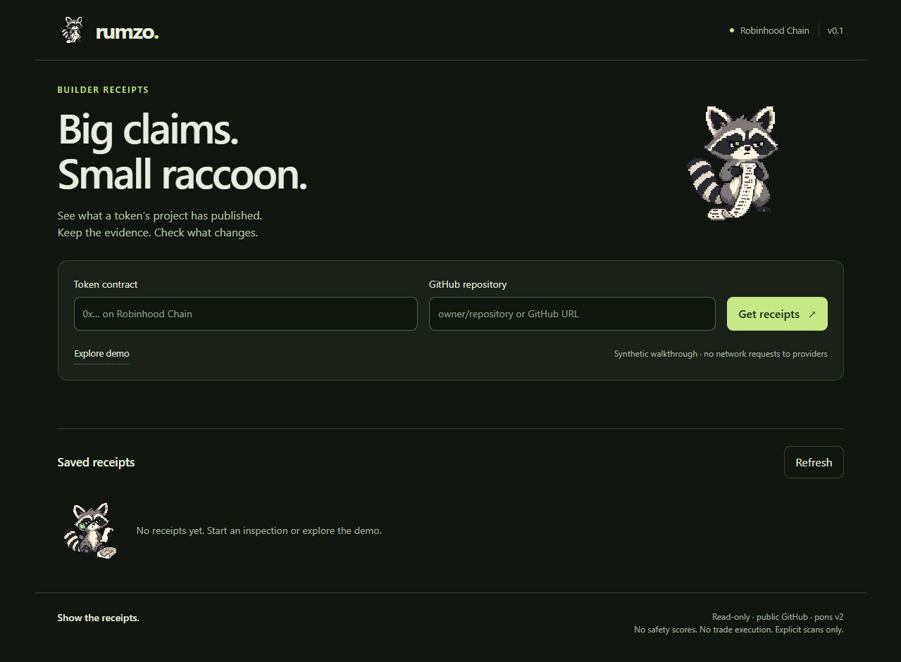
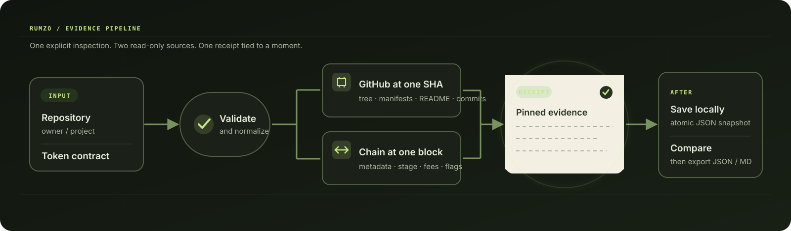
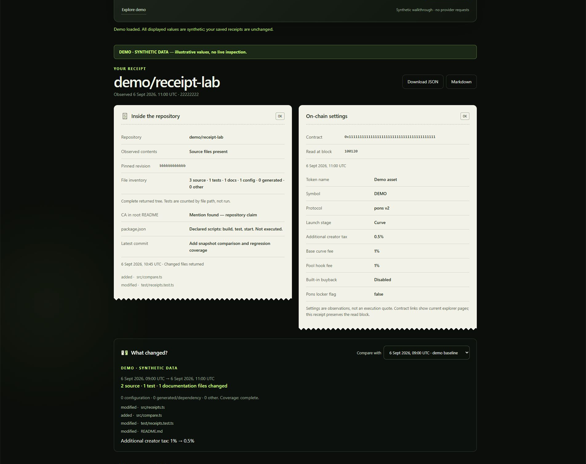
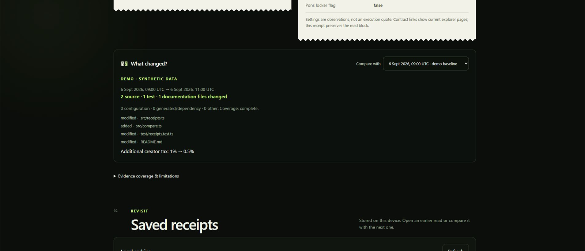
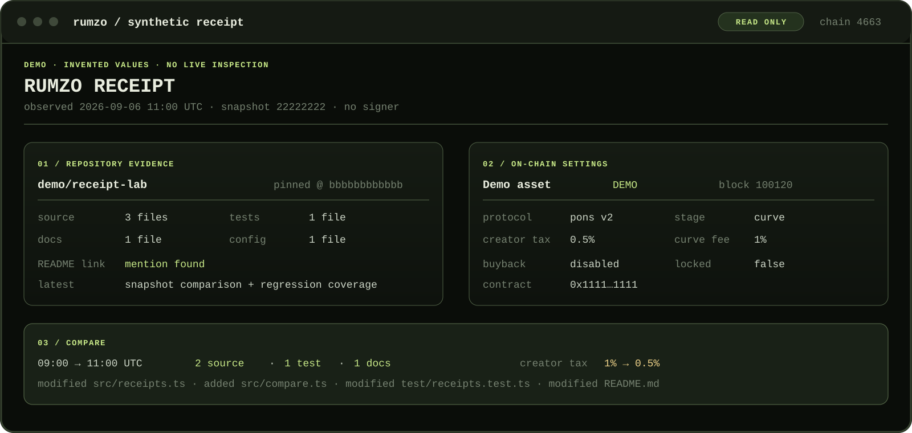

# RUMZO

**Show the receipts.** A small raccoon with a long paper trail.

Paste a token address and a public GitHub repository. RUMZO records the published code, reads the token's pons v2 settings on Robinhood Chain, and shows what changed between your inspections.

## How it works

| Look inside | Follow the changes | Keep the evidence |
| --- | --- | --- |
| Pinned GitHub revision, file inventory, manifests and README association | Source, tests and documentation compared separately; contract changes only when both values are known | Local receipts, observation times, block numbers, JSON and Markdown exports |

### Follow the evidence

### Read a receipt

### See what changed

These are screenshots of the running application. The report and comparison use the built-in **synthetic demo**, visibly labelled in the interface. Its addresses, values and revisions are invented; it does not inspect or represent a deployed token.

## Start locally

Requires **Node.js 22.13+** and **pnpm 11.19.0**. Node 24 is recommended. See the [official pnpm installation guide](https://pnpm.io/installation).

~~~sh
git clone https://github.com/Nekt-0/rumzo.git
cd rumzo
pnpm install --frozen-lockfile --ignore-scripts
pnpm run build
pnpm start
~~~

Open **http://127.0.0.1:4317**. Select **Explore demo** for an offline walkthrough, or enter your own token and repository and select **Get receipts** for a live inspection.

Demo reports stay separate from saved live receipts. They require no credentials and make no requests to GitHub or an RPC provider. The app runs on your computer and binds to loopback; it is not a hosted multi-user service.

## CLI

Replace the placeholders with the public project you want to inspect:

~~~sh
node dist/cli.js inspect --token <TOKEN_ADDRESS> --repo <OWNER/REPOSITORY>
node dist/cli.js inspect --token <TOKEN_ADDRESS> --repo <OWNER/REPOSITORY> --format json --output receipt.json
node dist/cli.js diff --before first.json --after second.json
node dist/cli.js serve --port 4318
~~~

An output filename must not already exist. Inspections also save a local receipt in the .rumzo directory. Exit codes: 0 completed (possibly partial), 1 input/local failure, 2 both upstream inspections unavailable. Read each section's status before using its values.

## What RUMZO checks

| Source | Observation | Boundaries |
| --- | --- | --- |
| GitHub tree | Files at a pinned commit; source, tests, docs, config and generated files | Up to 30,000 entries; incomplete trees are marked |
| GitHub manifests | Declared launch scripts | Up to six manifests, 128 KB each; scripts are never executed |
| Root README | Exact token-address mention | A repository claim, not proof of ownership |
| Recent commits | Latest changed files and recent activity | Up to 20 commits; no lifetime count or quality score |
| Robinhood Chain | Token metadata, launch stage, fee recipient, fees, buyback and locker flags | One recorded block on chain 4663; pons v2 factory only |
| Comparison | File-content/mode and established contract-value changes | Unknown never silently becomes zero or false |

No wallet connection or signatures. No inspected repository code is executed. RUMZO does not trade, rate token safety, predict prices, verify ownership or track fee income.

## Project layout

~~~text
assets/                 Original PNG illustrations, SVG icons and UI screenshots
docs/                   Architecture, methodology, testing and brand notes
examples/               Reproducible synthetic receipts and comparison
scripts/                Demo export utility
src/
  chain/                Configuration, ABIs, transport and contract reads
  demo/                 Isolated synthetic walkthrough
  github/               API client, file classification and repository inspection
  reports/              Inspection, comparison and Markdown export
  server/               Loopback HTTP application and static assets
  storage/              Atomic local snapshot storage
  cli.ts                Terminal entry point
  input.ts              Repository/address validation
  types.ts              Shared evidence and receipt types
test/                   Focused test files and reusable provider fixtures
web/                    Browser interface
~~~

## Development

~~~sh
pnpm run check          # TypeScript build and tests
pnpm run test:coverage  # Tests with Node's coverage report
pnpm run demo:export    # Regenerate synthetic examples after building
~~~

Tests exercise provider failures, pinned reads, incomplete trees, transport limits, comparisons, local HTTP behavior, exports, CLI errors and demo isolation. They use fixtures rather than live provider calls. CI runs on Node 22 and 24; inspect the [latest checks](https://github.com/Nekt-0/rumzo/actions) for the current commit.

## Configuration

| Variable | Default | Purpose |
| --- | --- | --- |
| GITHUB_TOKEN | Unset | Optional GitHub API capacity; public repositories only |
| RUMZO_RPC_URL | Public Robinhood Chain mainnet RPC | Custom HTTP(S) provider |
| RUMZO_DATA_DIR | .rumzo in the current directory | Local live-receipt storage |
| PORT | 4317 | Local web port |

Set variables in your shell, or copy .env.example to .env and run:

~~~sh
node --env-file=.env dist/cli.js serve
~~~

Never publish .env or provider credentials. More: [Architecture](docs/ARCHITECTURE.md) · [Methodology](docs/METHODOLOGY.md) · [Testing](docs/TESTING.md) · [Assets](assets/README.md) · [Security](SECURITY.md).

## Sources and license

Protocol reads use the published [pons v2 documentation](https://docs.ponsfamily.com/v2), [pons contract sources](https://github.com/ponsdotdev/ponsfamily), [Robinhood Chain documentation](https://docs.robinhood.com/chain/) and [GitHub REST API](https://docs.github.com/en/rest). RUMZO is independent of these services.

MIT — see [LICENSE](LICENSE).
